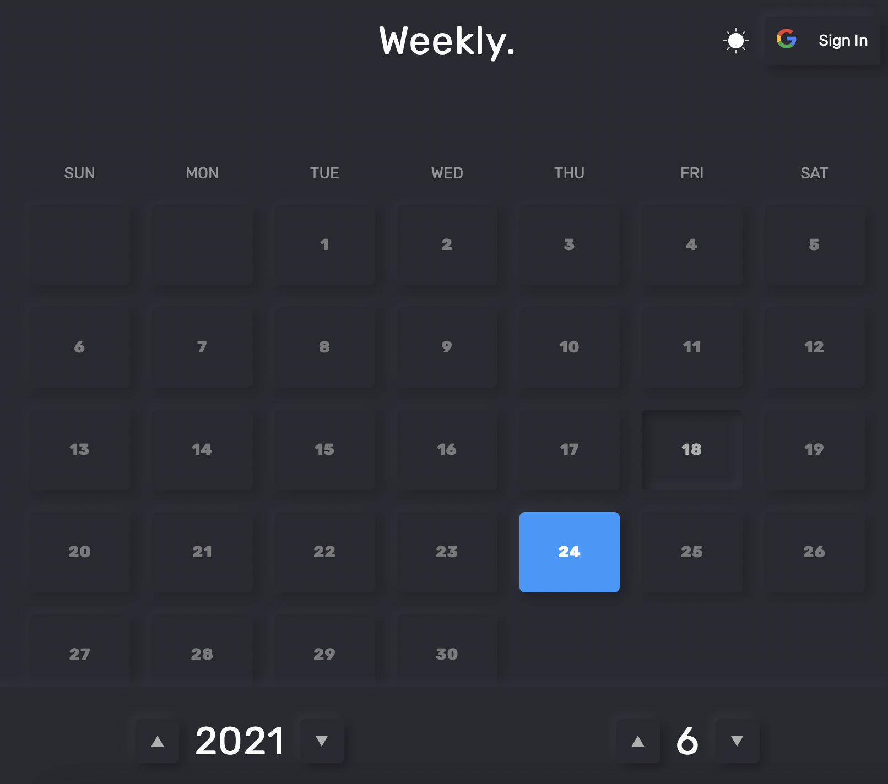
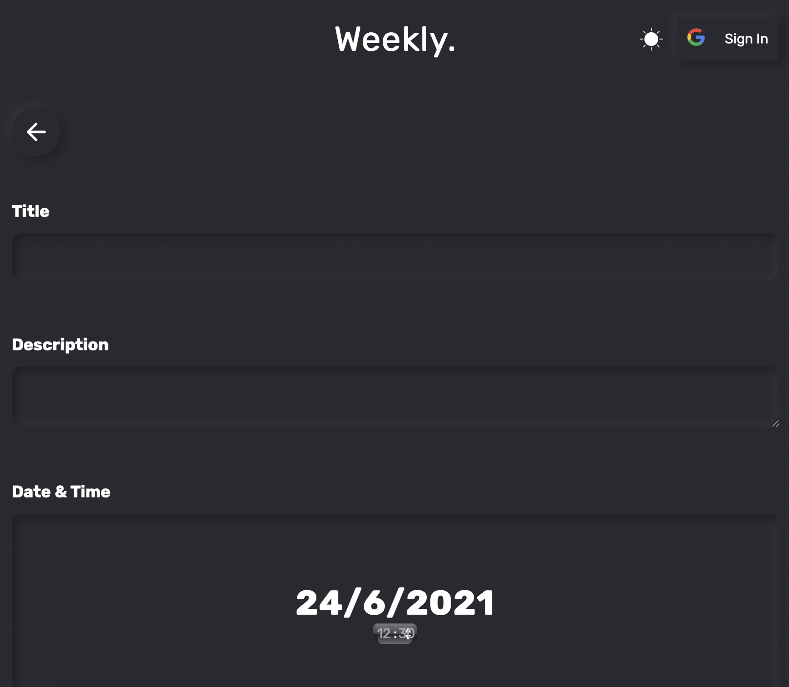
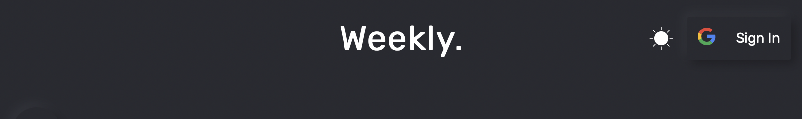
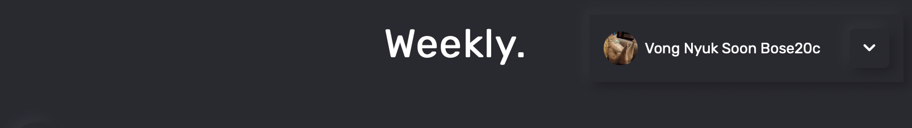

# Getting Started

### 1. Go to home page

### 2. Click on any day you want to add activity

### 3. Click the add button

### 4. Fill in detail of your activity

### 5. Sync with server \(optional\)

You may skip this step if you want, but if you want to browse all activities on different device, then you may follow this step.

#### 5.1 Click on the "sign-in" button on the top-right corner

**5.2 Select your account** 

**5.3 Completed sync**

When you see your avatar then it means all activities before will be synchronised to server.

\*\*\*\*

